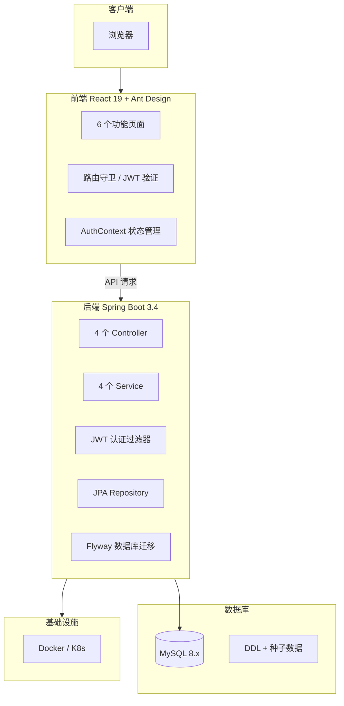

# Equipment Reservation System · 实验室设备预约与耗材管理系统

> 面向高校实验室的设备资源管理平台 — 预约创建、冲突检测、审批流程、库存追踪

---

## 目录

- [项目简介](#项目简介)
- [产品价值](#产品价值)
- [业务流程](#业务流程)
- [核心功能](#核心功能)
- [角色与权限](#角色与权限)
- [技术架构](#技术架构)
- [系统架构图](#系统架构图)
- [API 概览](#api-概览)
- [项目管理](#项目管理)
- [快速开始](#快速开始)
- [项目结构](#项目结构)
- [文档体系](#文档体系)
- [License](#license)

---

## 项目简介

**Equipment Reservation System** 是一个面向高校实验室的设备预约与耗材管理系统，解决实验室设备资源管理中的三个核心问题：

1. **设备使用冲突** — 多人同时预约同一设备的冲突检测
2. **审批流程缺失** — 预约需要管理员审核，避免资源滥用
3. **库存管理混乱** — 耗材出入库无记录，库存预警不及时

系统实现了从设备浏览、预约创建、冲突检测、审批管理到库存追踪的完整业务闭环。

### 为什么做这个项目

高校实验室的设备管理长期依赖人工登记，效率低、易出错、无法追溯。本项目的目标是以一个完整的业务系统来规范流程：让每台设备的预约有据可查、每个审批有迹可循、每件耗材有账可对。

---

## 产品价值

| 维度 | 说明 |
|------|------|
| 目标用户 | 高校实验室管理员、在校学生 |
| 核心场景 | 实验室设备预约、管理员审批、耗材库存管理 |
| 解决痛点 | 人工登记效率低、设备使用冲突、库存管理混乱 |
| 业务闭环 | 浏览 → 预约 → 审批 → 使用 → 归还 → 库存更新 |

---

## 业务流程

```
学生登录 → 浏览设备列表 → 选择设备 & 时间 → 提交预约
                                              ↓
                                       管理员审批 → 驳回（退回）
                                              ↓
                                           通过
                                              ↓
                                     学生领用设备 / 耗材
                                              ↓
                                     使用完毕归还设备
                                              ↓
                                       库存自动更新
```

---

## 核心功能

### 设备管理

| 功能 | 描述 |
|------|------|
| 设备浏览 | 展示设备列表，支持按分类筛选、按名称搜索 |
| 设备详情 | 查看设备规格、库存数量、当前预约状态 |
| 分类管理 | 设备分类的增删改查 |

### 预约管理

| 功能 | 描述 |
|------|------|
| 预约创建 | 选择设备和时间段，系统自动检测时间冲突 |
| 冲突检测 | 基于乐观锁的并发预约处理，确保同一时段不重复预约 |
| 预约审批 | 管理员通过/驳回预约申请 |
| 设备归还 | 确认设备归还，自动恢复库存 |
| 预约记录 | 查看个人/全部预约记录，按状态筛选 |

### 库存管理

| 功能 | 描述 |
|------|------|
| 入库管理 | 耗材入库记录，自动更新库存 |
| 领用管理 | 预约扣减库存，归还恢复库存 |
| 变更流水 | 完整记录所有库存变动，支持追溯 |

### 用户管理

| 功能 | 描述 |
|------|------|
| 注册登录 | JWT 认证，Token 管理 |
| 密码管理 | 修改密码、管理员重置密码 |
| 角色管理 | 管理员修改用户角色（ADMIN / STUDENT） |

---

## 角色与权限

| 角色 | 权限范围 |
|------|----------|
| 管理员 (ADMIN) | 管理设备、审批预约、管理用户、查看所有预约记录、库存管理 |
| 学生 (STUDENT) | 浏览设备、创建预约、查看个人预约记录 |

### 默认账号

| 角色 | 账号 | 密码 |
|------|------|------|
| 管理员 | admin | password |
| 学生 | user001 ~ user005 | 123456Ab |

---

## 技术架构

| 层级 | 技术 | 版本 | 用途 |
|------|------|------|------|
| 前端 | React + TypeScript + Vite | React ^19.2 | 用户界面 |
| UI 组件库 | Ant Design | ^6.5 | 企业级 UI 组件 |
| 后端 | Spring Boot | 3.4.1 | 业务服务框架 |
| JDK | Java | 21 | 开发语言 |
| ORM | JPA / Hibernate | - | 对象关系映射 |
| 数据库 | MySQL | 8.x | 关系型数据库 |
| 数据库迁移 | Flyway | - | 版本化数据库管理 |
| 认证 | JWT (jjwt 0.12.5) | - | 无状态认证 |
| 密码加密 | BCrypt | - | 安全哈希 |
| 部署 | Docker | - | 容器化 |
| 容器编排 | Docker Compose | - | 多服务编排 |
| 集群部署 | Kubernetes | - | 生产级部署（配置就绪） |

---

## 系统架构图



---

## API 概览

### 认证接口 `/api/auth`

| 方法 | 路径 | 说明 | 认证 |
|------|------|------|------|
| POST | `/api/auth/login` | 用户登录 | 否 |
| POST | `/api/auth/register` | 用户注册 | 否 |
| PUT | `/api/auth/change-password` | 修改密码 | 是 |
| POST | `/api/auth/logout` | 用户登出 | 是 |

### 设备接口 `/api/equipment`

| 方法 | 路径 | 说明 | 认证 |
|------|------|------|------|
| GET | `/api/equipment` | 获取所有设备列表 | 是 |
| GET | `/api/equipment/search` | 分页搜索设备 | 是 |
| GET | `/api/equipment/{id}` | 获取设备详情 | 是 |
| GET | `/api/equipment/categories` | 获取设备分类 | 是 |

### 预约接口 `/api/reservations`

| 方法 | 路径 | 说明 | 认证 |
|------|------|------|------|
| GET | `/api/reservations` | 获取预约列表 | 是 |
| POST | `/api/reservations` | 创建预约 | 是 |
| GET | `/api/reservations/conflict-check` | 冲突检测 | 是 |
| PUT | `/api/reservations/{id}/approve` | 审批通过 | 是 |
| PUT | `/api/reservations/{id}/reject` | 驳回预约 | 是 |
| PUT | `/api/reservations/{id}/return` | 确认归还 | 是 |

### 用户接口 `/api/users`

| 方法 | 路径 | 说明 | 认证 |
|------|------|------|------|
| GET | `/api/users` | 分页用户列表 | 是 |
| GET | `/api/users/{id}` | 用户详情 | 是 |
| PUT | `/api/users/{id}` | 修改用户 | 是 |
| PUT | `/api/users/{id}/reset-password` | 重置密码 | 是 |
| PUT | `/api/users/{id}/role` | 修改角色 | 是 |

---

## 项目管理

### 文档驱动开发

本项目按照"需求 → 设计 → 开发 → 验收"的完整流程推进：

| 阶段 | 产出 | 说明 |
|------|------|------|
| 需求分析 | [需求说明](/docs/requirement.md) | 用户角色定义、功能清单、页面流程 |
| 接口设计 | [API 文档](/docs/api.md) | RESTful 接口定义、参数说明、返回格式 |
| 开发实现 | Java + React 代码 | 前后端分离开发 |
| 验收测试 | [验收报告](/docs/acceptance.md) | 功能测试、边界条件验证 |

### 技术亮点

- **乐观锁处理并发预约**：设备表使用 `@Version` 注解，防止同一时段重复预约
- **JWT 无状态认证**：Token 存储在 localStorage，Axios 拦截器自动注入
- **Flyway 数据库迁移**：版本化的 SQL 脚本，确保数据库变更可追溯
- **前后端分离代理**：Vite 开发服务器将 `/api` 请求代理到后端 8080 端口
- **容器化部署就绪**：Dockerfile + K8s 配置齐全

---

## 快速开始

### 前置条件

- Node.js 18+
- Java 21+
- MySQL 8.x
- Maven 3.x

### 1. 数据库初始化

```bash
# 创建数据库
mysql -u root -p -e "CREATE DATABASE IF NOT EXISTS ers DEFAULT CHARACTER SET utf8mb4;"

# 导入表结构和种子数据
mysql -u root -p ers < database/schema.sql
mysql -u root -p ers < database/seed.sql
```

### 2. 启动后端

```bash
cd backend
mvn spring-boot:run
```

后端默认启动在 `http://localhost:8080`

### 3. 启动前端

```bash
cd frontend
npm install
npm run dev
```

前端默认启动在 `http://localhost:5173`

### 4. Docker 部署

```bash
# 构建后端镜像
cd backend && docker build -t ers-backend .
cd ..

# 构建前端镜像
cd frontend && docker build -t ers-frontend .
cd ..

# 启动 MySQL
docker run -d --name ers-mysql -e MYSQL_ROOT_PASSWORD=root -e MYSQL_DATABASE=ers -p 3306:3306 mysql:8

# 启动后端
docker run -d --name ers-backend --link ers-mysql -p 8080:8080 ers-backend

# 启动前端
docker run -d --name ers-frontend -p 80:80 ers-frontend
```

### 5. K8s 部署

```bash
kubectl apply -f k8s/namespace.yaml
kubectl apply -f k8s/
```

---

## 项目结构

```
equipment-reservation-system/
├── backend/                          # Spring Boot 后端
│   └── src/main/java/com/ers/
│       ├── controller/               # 4 个 Controller
│       ├── service/                  # 4 个 Service
│       ├── entity/                   # 7 个实体类
│       ├── repository/               # 5 个 Repository
│       ├── dto/                      # 8 个 DTO
│       ├── config/                   # 配置类
│       ├── exception/                # 异常处理
│       └── filter/                   # JWT 认证过滤器
├── frontend/                         # React 前端
│   └── src/
│       ├── pages/                    # 6 个功能页面
│       │   ├── Login/                # 登录
│       │   ├── Register/             # 注册
│       │   ├── EquipmentList/        # 设备列表
│       │   ├── ReservationCreate/    # 创建预约
│       │   ├── ReservationList/      # 预约记录
│       │   ├── Approval/             # 审批管理
│       │   └── UserManagement/       # 用户管理
│       ├── components/               # 通用组件
│       ├── context/                  # AuthContext
│       └── api/                      # API 调用
├── database/                         # 数据库脚本
│   ├── schema.sql                    # 建表语句
│   └── seed.sql                      # 初始化数据
├── docs/                             # 项目文档
│   ├── requirement.md                # 需求说明
│   ├── api.md                        # API 文档
│   └── acceptance.md                 # 验收报告
├── k8s/                              # Kubernetes 配置
│   ├── namespace.yaml
│   ├── backend-deployment.yaml
│   ├── frontend-deployment.yaml
│   └── mysql-statefulset.yaml
├── docker-compose.yml                # Docker 编排
├── README.md
└── LICENSE
```

---

## 文档体系

| 文档 | 路径 | 说明 |
|------|------|------|
| [需求说明](/docs/requirement.md) | docs/requirement.md | 用户角色、功能清单、页面清单 |
| [API 文档](/docs/api.md) | docs/api.md | 全部接口定义、参数、返回格式 |
| [验收报告](/docs/acceptance.md) | docs/acceptance.md | 功能验收、边界测试 |
| [数据库脚本](/database/schema.sql) | database/schema.sql | 5 张表的 DDL |
| [种子数据](/database/seed.sql) | database/seed.sql | 默认账号、设备、分类数据 |

---

## License

Apache 2.0
