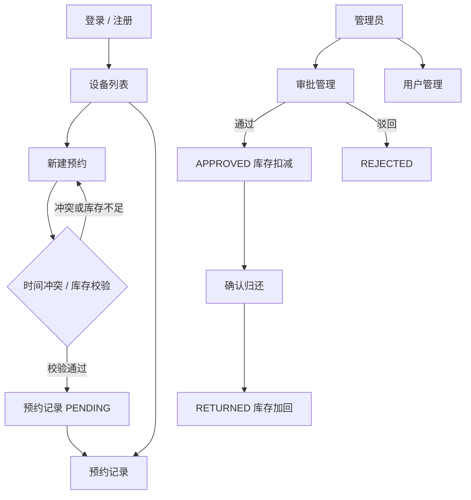
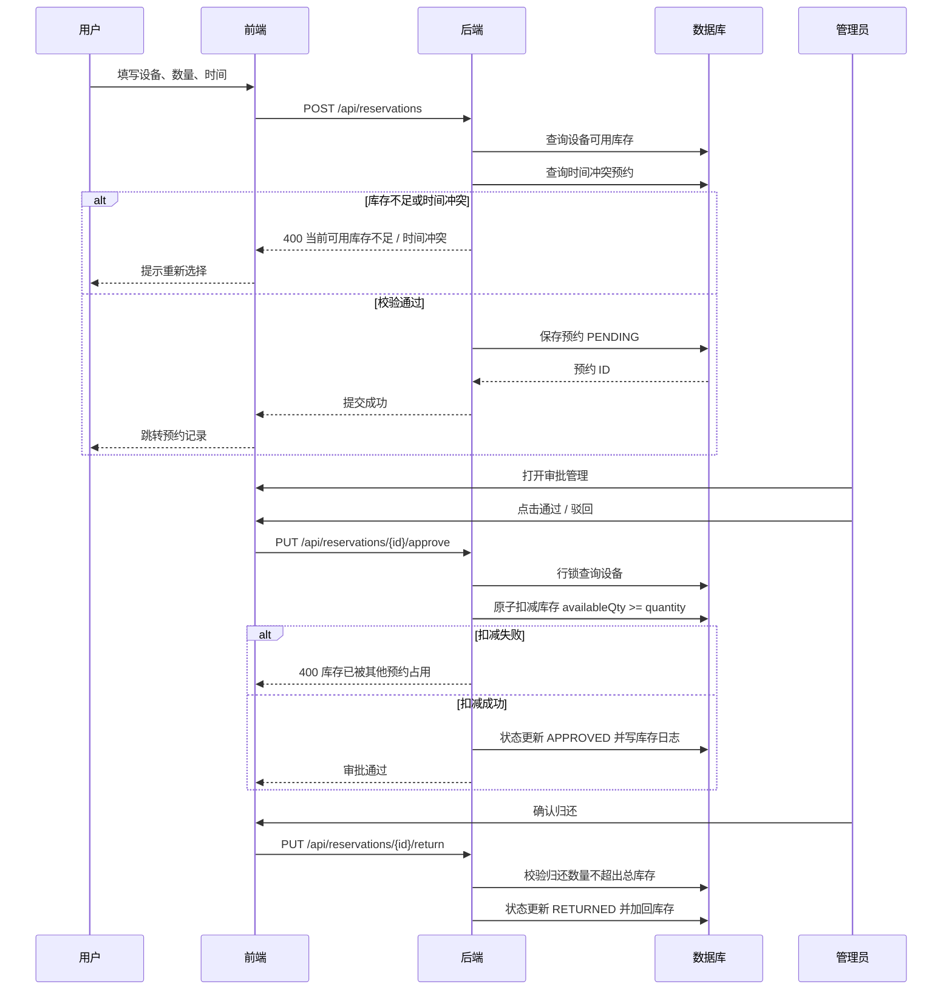
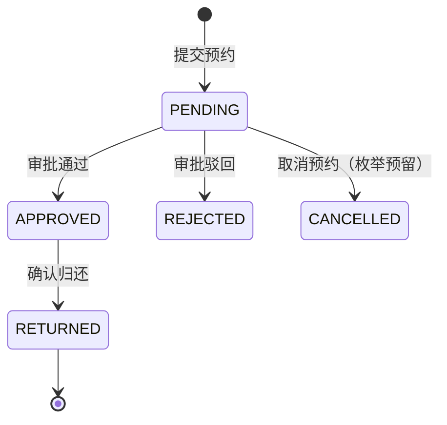

# 核心流程与状态图

本文用图说明设备预约系统的页面流转、审批时序与预约状态机，供评审、文档查阅和面试讲解使用。

## 1. 用户页面流程图

## 2. 预约审批时序图

## 3. 预约状态机

| 当前状态 | 触发动作 | 条件 | 目标状态 | 系统处理 |
|---|---|---|---|---|
| PENDING | 提交 | 时间不冲突、数量 <= 可用库存 | PENDING | 保存预约 |
| PENDING | 审批通过 | 无冲突、库存足够 | APPROVED | 原子扣减库存、写库存日志 |
| PENDING | 审批驳回 | 管理员操作 | REJECTED | 更新状态 |
| APPROVED | 确认归还 | 归还后库存不超总库存 | RETURNED | 库存加回、写库存日志 |
| PENDING | 取消 | 预留能力 | CANCELLED | 当前接口未开放 |

## 4. 关键设计点

- 库存扣减使用数据库原子更新，避免并发审批超卖。
- PENDING 阶段只做校验不扣库存，避免未审批预约长期占用库存。
- 审批时再次进行冲突与库存校验，防止审批前数据变化。
- 归还时校验可用库存 + 归还数量 <= 总库存，防止重复归还。
